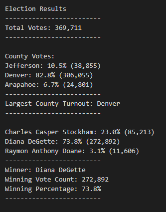

# PyPoll Analysis (using Python)
---
## Overview of Project
---
In this week's challenge, we're assisting a Colorado Board of Elections employee named Tom. The challenge
aims to audit a Congressional precinct in Colorado and report the results of the election.

### Purpose
In using Python, we can access, process and manipulate the data to produce the desired outcomes for Tom.
With the intention to certify the congressional race, we're using Python to automate the following key metrics:
the total votes casted, the total votes for each candidate, the 
percentage of votes for each candidate and the winner of the election based on popular votes.

## Election-Audit Results
---
**THE ASK/PROCESS** 
>In this week's challenge, we were provided a csv file (source) that reflects all the votes casted.  The data consisted of the "Ballot ID", the "County" in which
the ballot was casted, and the respective "Candidate" chosen for that ballot. Next, a starter code was already provided and the ask was to finish the code.

>As such, additional code was added to create new lists [] and dictionaries {} , for the purpose of storing the data to be produced in the upcoming loops. 
Then after initializing new variables, the code runs to read the csv file using the *reader* function. In reading the file, we created loops using *'for'* to circle through the candidates and counties and take count of each vote casted. Suitably, the results print to both the terminal and the text file.  

**THE RESULTS**
 >
 
* *How many votes were cast in this congressional election?* 
Based on the results, there were **369,711** votes casted in this election. 

* *Provide a breakdown of the number of votes and the percentage of total votes for each county in the precinct.* 
    In this election, we looked at 3 different counties: Jefferson, Denver and Arapahoe. 
    - **Arapahoe** had the lowest voter turnout with **24,801** votes, roughly **6.7%** of the total votes. 
    - **Jefferson** came in next with **38,855** votes, which was about **10.5%** of the total votes. 
    - And lastly, **Denver** had the biggest turnout with **306,055** votes or **82.8%** of the total votes. 

* *Which county had the largest number of votes?* 
**Denver** had the largest county turnout of votes.

* *Provide a breakdown of the number of votes and the percentage of the total votes each candidate received.* 
  There were a total of 3 candidates: Charles Casper Stockham, Diana DeGette and Raymon Anthony Doane. 
  - With the least amount of votes, candidate **Doane** received only **11,606** votes (**3.1%** of the total votes). 
  - Next, candidate **Stockham** received **85,213** votes (**23.0%** of the total votes). 
  - Finally, candidate **DeGette** received **272,892** votes (**73.8%** of the total votes).

* *Which candidate won the election, what was their vote count, and what was their percentage of the total votes?*  
After tallying all the scores, candidate **Diane DeGette** won the election with **272,892** votes , which was **73.8%** of the total votes.

## Election-Audit Summary
---
In this U.S. congressional race, we were able to verify all the votes (whether
it be my mail-in ballot, punch cards or direct recording electronic) and determine a winner.
Since we were able to sift through 369,711 votes in a short period of time and deliver an outcome
with marginal error, it's safe to assume we could expand this method into other elections. You could even bring in extra data
to look at the cities within the three counties and loop through for city voter turnout. Moreso, with the ability
to sift through large data, the script can be used to audit other congressional districts. Even modifying the script by cities or
districts, it can narrow into local elections or extend to senatorial districts. The possiblities are endless.

Additionally, in such a pivotal year like 2020, this script can even extend to the presidential election.
In the year of accused fraud and recounting is demanded, this script becomes invaluable because it can deliver a quick
and concise answer. Voters are no longer left in anticipation, waiting for states, like Nevada, to finish counting because
the script would have looped through the information. Furthermore, with the automation, 
we can minimize human error and leave less room for scrutiny.  

